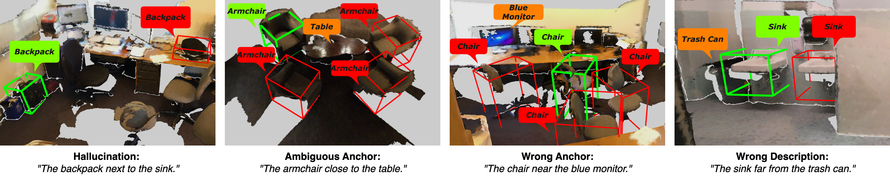
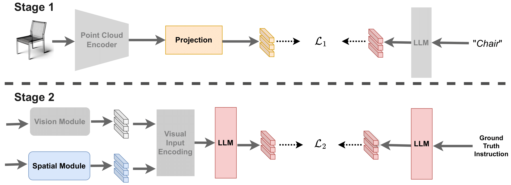

# 3D Spatial Understanding in MLLMs (ICRA 2025)

<a href='https://birdy666.github.io/projects/3d_spatial_understanding_in_mllms/'></a>
<a href='[https://arxiv.org/pdf/2309.05519](https://arxiv.org/pdf/2412.06613)'></a>
[](https://www.youtube.com/watch?v=Aq9gmHn-op4)

[Chun-Peng Chang](https://chunpeng-chang.github.io/), [Alain Pagani](https://av.dfki.de/members/pagani/), [Didier Stricker](https://av.dfki.de/members/stricker/)

**[DFKI AV](https://av.dfki.de/), German Research Center for Artificial Intelligence, Augmented Vision**


## Evaluation with 3DVG
For the evaluation with 3D Visual Grounding model in the experiments, please refer to the following works:
* [ReferIt3D](https://github.com/referit3d/referit3d)
* [MVT](https://github.com/sega-hsj/MVT-3DVG)
* [MiKASA](https://birdy666.github.io/projects/mikasa/)

### Setup
We split the training scenes of Nr3D and Sr3D into two halves. The first half is used to train the model. From the second half, we generate approximately 65K spatially-grounded instructions—comparable in size to the Sr3D training set—which are then used to train our 3D Visual Grounding (3DVG) models. This split ensures that the VLM and 3DVG models are trained on disjoint scenes to avoid data leakage.

During instruction generation, we randomly assign target objects from each scene, ensuring that each selected target has at least one distractor (i.e., another object of the same category). We also randomly sample three potential anchors (reference objects) per scene, which the model must use to disambiguate the target.

## Data Preparation
### ScanNet Data
To download the ScanNet scans, see [ScanNet](https://github.com/ScanNet/ScanNet#scannet-data) for the instruction.
To preprocess the data required for Referit3D challenge, visit [ReferIt3D](https://github.com/referit3d/referit3d).

### Referit3D Linguistic Data (Nr3D/Sr3D/Sr3D+)
 See [ReferIt3D](https://github.com/referit3d/referit3d) for more details.
* [**Nr3D**](https://drive.google.com/file/d/1qswKclq4BlnHSGMSgzLmUu8iqdUXD8ZC/view?usp=sharing) (10.7MB)
* [**Sr3D**](https://drive.google.com/drive/folders/1DS4uQq7fCmbJHeE-rEbO8G1-XatGEqNV?usp=sharing) (19MB)
* [**Sr3D+**](https://drive.google.com/drive/folders/1DS4uQq7fCmbJHeE-rEbO8G1-XatGEqNV?usp=sharing) (20MB)

## Environment
All experiments were conducted using a single A100-80GB GPU.
* Ubuntu: 20.04
* CUDA: 12.1
* PyTorch: 2.1.2
* python: 3.8
* torchvision: 0.14.1
* torchaudio: 0.13.1
* pytorch-cuda: 11.6

## Installation
For the dependencies please refer requirements.txt
* LLM Base Model: [Vicuna-7b](https://huggingface.co/lmsys/vicuna-7b-delta-v0)
* To use a PointNet++ visual-encoder you need to compile its CUDA layers for [PointNet++](http://arxiv.org/abs/1706.02413):
```Note: To do this compilation also need: gcc5.4 or later.```
```Console
    cd external_tools/pointnet2
    python setup.py install
```

## Input Setup 1 – Object Recognition from Upstream Task

In most of our cases, object recognition is handled by a standalone module shared across multiple tasks. Since we can directly access object labels and their corresponding locations, we skip point cloud processing and instead use this structured object information as direct input. 
Under this set up we directly start from stage 2 shown below.

## Input Setup 2 – Point Cloud as Input
(Release soon)

If only raw point clouds are available, we follow the approach from [InstanceRefer](https://github.com/CurryYuan/InstanceRefer), which utilizes the pretrained [PointGroup](https://github.com/dvlab-research/PointGroup) model to produce panoptic segmentation.

Alternatively, if segmented point clouds are provided—as in the [ReferIt3D](https://github.com/referit3d/referit3d) task—we used a pretrained PointNet++ from [MiKASA](https://birdy666.github.io/projects/mikasa/) to extract instance-level features.

Regardless of the point cloud setup, we require an additional Vision-Language Alignment stage to bridge the gap between geometric data and language.



---

### Stage 1: Vision-Language Alignment

In this stage, we extract object-level features from 3D point clouds and align them with corresponding textual labels. The label embeddings are generated by a LLM, and the alignment process maps both modalities into a shared embedding space. This step establishes semantic grounding between 3D geometry and language.

---

### Stage 2: Instruction Grounding with LoRA

Once the embeddings are aligned, we fine-tune the model for precisely describe the target location. All backbone parameters remain frozen, and only the LoRA modules are trained. 
```Console
    lora_r: 32
    lora_alpha: 16
    lora_dropout: 0.1
```


## Citation
```
@article{chang20243d,
      title={3D Spatial Understanding in MLLMs: Disambiguation and Evaluation},
      author={Chang, Chun-Peng and Pagani, Alain and Stricker, Didier},
      journal={arXiv preprint arXiv:2412.06613},
      year={2024}
    }
```

## Credit
The project is built based on the following repository:
* [NExT-GPT: Any-to-Any Multimodal LLM](https://next-gpt.github.io/)
* [MiKASA](https://birdy666.github.io/projects/mikasa/) 
